## Table of Contents

1. [Business Requirements](#business-requirements)
2. [User Stories](#user-stories)
3. [Epics](#epics)
4. [Dataset Content](#dataset-content)
5. [Hypothesis and validation](#hypothesis-and-how-to-validate)
6. [The model](#the-model)
7. [Implementation of the Business Requirements](#the-rationale-to-map-the-business-requirements-to-the-data-visualizations-and-ml-tasks)
8. [ML Business case](#ml-business-case)
9. [Dashboard design](#dashboard-design)
10. [Business Requirements Evaluation](#requirements-evaluation)
11. [CRISP DM Process](#crisp-dm-process)
12. [Improvements and Future Plans](#improvements-and-future-plans)
13. [Bugs](#bugs)
14. [Deployment](#deployment)
15. [Data Analysis and Machine Learning Libraries](#data-analysis-and-machine-learning-libraries)
16. [Technologies used](#Technologies-used)
17. [Credits](#credits)
18. [Acknowledgements](#Acknowledgements)

---

### Deployed version at [AI-DermDiagnosis](https://ai-dermdiagnosis-75d8dba881ea.herokuapp.com/)

---

## Introduction

- AI-Derm is a healthcare startup that uses artificial intelligence for dermatological diagnoses. It is spearheading a project to develop an AI-powered application that can help healthcare professionals and individuals identify skin cancer at an early stage. The primary aim is to distinguish between different lesion types, providing an immediate diagnosis and confidence level, which would recommend further medical consultation if necessary.

## Business Requirements

- Currently, the process of diagnosing skin cancer is often time-consuming and requires expert analysis. A dermatologist might need to examine the suspicious lesion visually, perform a dermoscopic analysis, and in some cases, conduct a biopsy to definitively diagnose if the skin lesion is malignant. This process can take from days to weeks, depending on various factors such as the healthcare system's efficiency and the need for further tests.

- However, early detection of skin cancer, particularly malignant melanoma, is crucial for effective treatment. When identified at an early stage, the survival rate for melanoma is significantly high. However, if the cancer has spread to other parts of the body, the survival rate drops dramatically. This underlines the importance of rapid and accurate diagnosis.

- The proposed AI model could provide instant predictions with associated confidence levels, significantly reducing the time required to identify potential malignant skin lesions. This immediacy could lead to earlier consultations and interventions, increasing the chances of successful treatment. It's important to note that while the AI model can assist with initial screening and diagnosis, any prediction it makes must be verified by a healthcare professional to ensure accuracy and safety.

  - **Business Requirement 1**: The client aims to visually differentiate lesions. The model should be capable of reaching an accuracy of at least 70%.

  - **Business Requirement 2**: The model should provide a confidence level for each prediction.

  - **Business Requirement 3**: If a skin lesion is predicted as malignant with high confidence, the system should recommend immediate medical consultation.

  - **Business Requirement 4**: The project will deliver a web application where users can upload a skin lesion image, and the system will provide a diagnosis, a confidence level of the prediction.

  - **Business Requirement 5**: The AI model's insights should assist healthcare professionals in making informed decisions about the treatment process.

  - **Business Requirement 6**: The model's performance will be evaluated using balanced performance metrics such as F1 Score.

  - **Business Requirement 7**: The client is interested to have a study to visually differentiate between lesions.

This solution aims to augment the decision-making process for dermatologists and bring about a transformative change in the early detection and treatment of skin cancer.

---

## User Stories

The user stories have been mapped to which Business Requirement they solve.

[View Project](https://github.com/users/dlhamilton/projects/)

### Must Have User Stories

- [#1](https://github.com/dlhamilton/AI-DermDiagnosis/issues/1) As a data scientist, I must create a machine learning model that can differentiate between different types of skin lesions, so that the system can provide accurate diagnoses. (Business Requirement 1)
- [#2](https://github.com/dlhamilton/AI-DermDiagnosis/issues/2) As a user, I need a web application where I can upload an image of a skin lesion and receive an instant predition, so I can assess the urgency of medical consultation.(Business Requirement 3 and 4)
- [#3](https://github.com/dlhamilton/AI-DermDiagnosis/issues/3) As a user, I need the system to provide a confidence level with each prediction, so I can understand how certain the model is about its diagnosis. (Business Requirement 2)
- [#4](https://github.com/dlhamilton/AI-DermDiagnosis/issues/4) As a healthcare professional, I need the AI model to recommend immediate medical consultation if a skin lesion is predicted as malignant with high confidence, so I can expedite the treatment process. (Business Requirement 2)

### Should Have User Stories

- [#5](https://github.com/dlhamilton/AI-DermDiagnosis/issues/5) As a data scientist, I should implement a clustering algorithm to identify common characteristics associated with benign or malignant conditions, to improve the machine learning model's understanding and prediction accuracy.(Business Requirement 5 and 6)
- [#6](https://github.com/dlhamilton/AI-DermDiagnosis/issues/6) As a user, I should receive information about the associated lesion type when I upload an image, so I can learn more about the nature of the skin lesion. (Business Requirement 5 and 6)

### Could Have User Stories

- [#7](https://github.com/dlhamilton/AI-DermDiagnosis/issues/7) As a user, I could have access to a example skin lesion images within the app, so I can compare my skin lesion with others.(Business Requirement 7)
- [#8](https://github.com/dlhamilton/AI-DermDiagnosis/issues/8) As a healthcare professional, I could have access to the details of the machine learning model's prediction process, so I can better understand how the AI system reached its conclusion.(Business Requirement 6)

### Won't Have this Time User Stories

- [#9](https://github.com/dlhamilton/AI-DermDiagnosis/issues/9) As a user, I won't have the ability to use the app for definitive medical diagnosis, as the app serves to provide an additional layer of information and should not replace professional medical advice.
- [#10](https://github.com/dlhamilton/AI-DermDiagnosis/issues/10) As a data scientist, I won't develop a feature for users to track changes in their skin lesions over time within the app, as it falls outside the scope of the current project.

---

## Epics

### Epic 1: Machine Learning Model Development

#### Epic 1 - Must Have

- As a data scientist, I must create a machine learning model that can differentiate between benign and malignant skin lesions, so that the system can provide accurate diagnoses.

#### Epic 1 - Should Have

- As a data scientist, I should implement a clustering algorithm to identify common characteristics associated with benign or malignant conditions, to improve the machine learning model's understanding and prediction accuracy.
  
### Epic 2: Web Application Design and Deployment

#### Epic 2 - Must Have

- As a user, I need a web application where I can upload an image of a skin lesion and receive an instant prediction, so I can assess the urgency of medical consultation.

#### Epic 2 - Could Have

- As a user, I could have access to a database of example skin lesion images within the app, so I can compare my skin lesion with others.

### Epic 3: Confidence Level and Medical Consultation Recommendation

#### Epic 3 - Must Have

- As a user, I need the system to provide a confidence level with each prediction, so I can understand how certain the model is about its diagnosis.
- As a healthcare professional, I need the AI model to recommend immediate medical consultation if a skin lesion is predicted as malignant with high confidence, so I can expedite the treatment process.
-

### Epic 4: Cluster Identification and Display

#### Epic 4 - Should Have

- As a user, I should receive information about the associated cluster when I upload an image, so I can learn more about the nature of the skin lesion.

### Epic 5: Information Accessibility for Healthcare Professionals

#### Epic 5 - Could Have

- As a healthcare professional, I could have access to the details of the machine learning model's prediction process, so I can better understand how the AI system reached its conclusion.

### Epic 6: Limitations and Future Enhancements

#### Epic 6 - Won't Have this Time

- As a user, I won't have the ability to use the app for definitive medical diagnosis, as the app serves to provide an additional layer of information and should not replace professional medical advice.
- As a data scientist, I won't develop a feature for users to track changes in their skin lesions over time within the app, as it falls outside the scope of the current project.

---

## Dataset Content

- The dataset is sourced from [Kaggle](https://www.kaggle.com/datasets/kmader/skin-cancer-mnist-ham10000). We then created a fictitious user story where predictive analytics can be applied in a real project in the workplace.
- The dataset contains dermatoscopic images from different populations, acquired and stored by different modalities. The dataset consists of 10015 dermatoscopic images which can serve as a training set for machine learning purposes. The data set have a collection of all important diagnostic categories in the realm of pigmented lesions: Actinic keratoses and intraepithelial carcinoma / Bowen's disease (akiec), basal cell carcinoma (bcc), benign keratosis-like lesions (solar lentigines / seborrheic keratoses and lichen-planus like keratoses, bkl), dermatofibroma (df), melanoma (mel), melanocytic nevi (nv) and vascular lesions (angiomas, angiokeratomas, pyogenic granulomas and hemorrhage, vasc).

### Data set breakdown

#### categories of skin lesions

- Actinic keratoses and Intraepithelial Carcinoma / Bowen's disease (akiec): These are precancerous or early forms of skin cancer that can become malignant if left untreated.
- Basal Cell Carcinoma (bcc): This is a type of skin cancer and is therefore malignant. It's one of the most common types of skin cancer.
- Benign keratosis-like lesions (Solar Lentigines / Seborrheic Keratoses and Lichen Planus-like Keratoses, bkl): These are typically benign and are not cancerous.
- Dermatofibroma (df): These are benign skin growths.
- Melanoma (mel): This is a type of skin cancer and is therefore malignant. Melanoma is the most dangerous type of skin cancer.
- Melanocytic Nevi (nv): These are commonly known as moles. They are typically benign but can become malignant, turning into melanoma.
- Vascular lesions (Angiomas, Angiokeratomas, Pyogenic Granulomas, and Hemorrhage, vasc): These are typically benign, but like all skin conditions, any changes should be monitored for potential malignancy.

#### categories of diagnosis

- Histopathology (histo): This is the most definitive diagnosis method and involves examining cells or tissues under a microscope to check for abnormalities. When a lesion is confirmed by histopathology, it means a biopsy was performed, and the lesion was examined in a lab. If a user receives a high-confidence prediction that aligns with this method, it's essential to consult a healthcare professional immediately for further examination and treatment.

- Follow-up examination (follow_up): This diagnosis method involves monitoring the lesion over time to check for changes. If the AI system indicates a need for a follow-up based on changes in the lesion, it would be wise to consult a healthcare professional for an in-person evaluation.

- Expert consensus (consensus): This diagnosis is determined when a group of dermatologists agrees on the nature of the lesion after examining it. If the prediction matches with an expert consensus, consulting a healthcare professional for an in-person examination is recommended.

- In-vivo confocal microscopy (confocal): This non-invasive imaging technique provides a real-time "optical biopsy" of the skin, allowing for a diagnosis without the need for a physical biopsy. If a high-confidence prediction aligns with this method, it should be taken seriously, and an in-person consultation with a healthcare professional is necessary.

In all cases, regardless of the diagnostic method, a prediction by the AI should be considered as a suggestion or an additional tool for skin cancer screening, not a definitive diagnosis. A healthcare professional should always be consulted for accurate diagnosis and treatment recommendations.

---

## Hypothesis and how to validate

### Hypothesis 1

Providing a confidence level for each prediction would allow users to gauge the urgency of a medical consultation. For example: telling someone that there is a 70% chance the lesion could be cancerous would get them to check the lesion sooner. 

**Validation Approach**: The validation approach involves analyzing user feedback and statistical analysis to determine if the provision of confidence levels influenced users' decisions for medical consultations. The findings from the analysis and studies will provide insights into whether the hypothesis holds true.

**Result**: More time will be needed to see if the confidence level is getting people to go and see consultants sooner. the feedback section in the app and speaking to consultans to see if there has been a increase of people getting lesions checked. 

### Hypothesis 2

An Image Montage shows that typically a malignant lesion has a darker colour and a solid shape. Average Image, Variability Image and Difference between Averages studies did reveal a clear difference with malignant lesions.

**Validation Approach**: The validation approach involves a combination of visual analysis, expert opinions, and statistical analysis to validate the observed differences in color and shape between malignant and non-malignant lesions. The involvement of domain experts and the collection of additional data contribute to the validation process.

**Result**: The compansion on the app showed this to be true and that a dark lesion is more likely to be dangerous. Average Image, Variability Image and Difference between Averages studies did reveal a clear difference with malignant lesions.

### Hypothesis 3

An AI-powered web application will expedite the skin cancer diagnosis process, leading to early detection and better survival rates.

**Validation Approach**: Monitor the usage metrics of the web application, including the number of unique users, number of images uploaded, and time to consultation after receiving a prediction. Additionally, conduct surveys or interviews with healthcare professionals to determine if they've seen improvements in the early detection and treatment of skin cancers. Positive feedback and statistics would validate this hypothesis.

**Result**: The use of the app has increased. More time will be needed to see if the early dectection is improving treatment and increasing the survival rate. 

---

## The Model
The model has 1 input layer, Multiple Convolutional and Pooling Layers in the base model (Xception), 1 Flatten Layer, 1 Dense Layer, 1 Output Layer.

Base Model: The base model is initialized using the Xception architecture. Xception is a deep convolutional neural network (CNN) model that has shown excellent performance on image classification tasks. It is pre-trained on the ImageNet dataset, which provides a strong foundation for feature extraction.

Trainable Layers: By default, all layers in the Xception base model are set to be trainable. This means that during the training process, the weights of these layers will be updated based on the data specific to the skin lesion classification task.

Sequential Model: The Sequential model is initialized to build the classification model on top of the base model.

Flatten Layer: The Flatten layer is added to convert the multi-dimensional output of the base model into a one-dimensional feature vector, which can be input to the following dense layers.

Dense Layers: Two dense layers are added after the Flatten layer to learn high-level representations from the extracted features.

Dropout Layer: The Dropout layer with a dropout rate of 0.5 is added to mitigate overfitting. It randomly sets a fraction of input units to 0 during training, which helps prevent the model from relying too much on specific features.

Batch Normalization Layer: The Batch Normalization layer is added to normalize the activations of the previous layer, which helps stabilize and speed up the training process.

Activation Function: The ReLU (Rectified Linear Unit) activation function is chosen as the activation function for the dense layers. ReLU is commonly used in deep learning models as it introduces non-linearity and helps the model learn complex patterns.

Output Layer: The output layer consists of a Dense layer with a number of units equal to the number of classes (num_classes) in the skin lesion classification task. The model uses a softmax activation function to output the predicted probabilities for each class.

Loss Function: The model is compiled with the SparseCategoricalCrossentropy loss function, which is suitable for multi-class classification problems. It computes the cross-entropy loss between the true labels and the predicted probabilities.

Optimizer: The Adam optimizer is chosen as the optimizer for training the model. Adam is an adaptive learning rate optimization algorithm that combines the benefits of the RMSprop and AdaGrad algorithms. It helps accelerate the training process and converges to a good solution efficiently.

Metrics: The model is evaluated using the accuracy metric, which calculates the proportion of correctly classified samples during training and evaluation.

### Trial and Error
In addition to the current iteration, there were four previous iterations of the model, each documented in separate notebooks. These iterations employed different techniques to address the challenges of imbalanced data, including SMOTE upsampling, downsampling, and the use of different models.

The purpose of these iterations was to explore various approaches and evaluate their effectiveness in improving the model's performance. Each iteration represents a unique attempt to tackle the imbalanced data issue and enhance the model's ability to accurately classify skin lesions.

By employing techniques such as SMOTE upsampling and downsampling, the previous iterations aimed to address the class imbalance problem by either generating synthetic samples or reducing the number of majority class samples. These techniques were used in conjunction with different models to examine their impact on model performance.

Overall, these iterations demonstrate a comprehensive exploration of techniques and models, reflecting a deep understanding of the challenges posed by imbalanced data and a systematic approach to finding effective solutions. Below are some of the tasks that I used to help perfect the model.mYou can see the full solutions in the jupyter_notbooks.

### Model Tasks

#### Set image shape
```
image_shape = (75, 75, 3)
image_shape

joblib.dump(value=image_shape ,
            filename=f"{file_path}/image_shape.pkl")

import joblib
image_shape = joblib.load(filename=f"{file_path}/image_shape.pkl")
image_shape

```

#### Study for average and variability image
```
def plot_mean_variability_per_labels(X, y, figsize=(12, 5), save_image=False):
    """
    The pseudo-code for the function is:
    * Loop over all labels
    * Subset an array for a given label
    * Calculate the mean and standard deviation
    * Create a figure displaying the mean and variability of images
    * Save the image
    """

    for label_to_display in np.unique(y):
        sns.set_style("white")

        y = y.reshape(-1, 1, 1)
        boolean_mask = np.any(y == label_to_display, axis=1).reshape(-1)
        arr = X[boolean_mask]

        avg_img = np.mean(arr, axis=0)
        std_img = np.std(arr, axis=0)
        print(f"==== Label {label_to_display} ====")
        print(f"Image Shape: {avg_img.shape}")
        fig, axes = plt.subplots(nrows=1, ncols=2, figsize=figsize)
        axes[0].set_title(f"Average image for label {label_to_display}")
        axes[0].imshow(avg_img, cmap='gray')
        axes[1].set_title(f"Variability image for label {label_to_display}")
        axes[1].imshow(std_img, cmap='gray')

        if save_image:
            plt.savefig(f"{file_path}/avg_var_{label_to_display}.png",
                        bbox_inches='tight', dpi=150)
        else:
            plt.tight_layout()
            plt.show()
            print("\n")
```
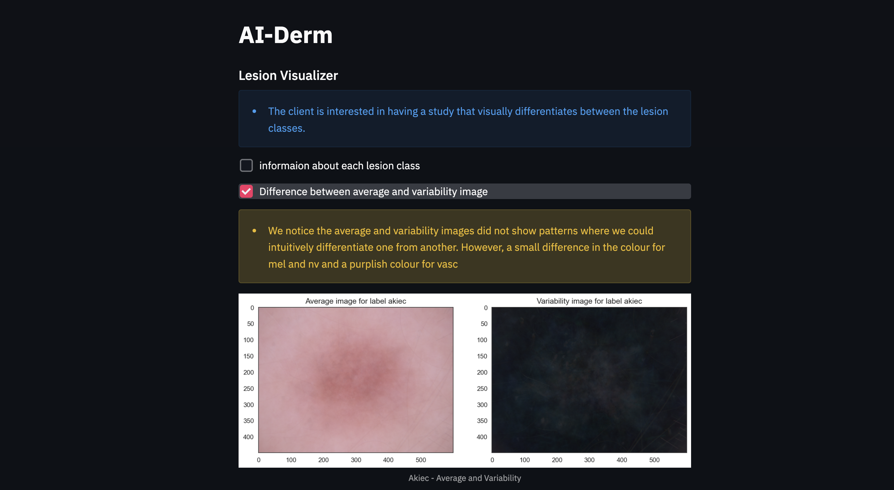

#### The difference between average images
```
def subset_image_label(X, y, label_to_display):
    y = y.reshape(-1, 1, 1)
    boolean_mask = np.any(y == label_to_display, axis=1).reshape(-1)
    df = X[boolean_mask]
    return df


def diff_bet_avg_image_labels_data_as_array(X, y, label_1, label_2, figsize=(20, 5), save_image=False):
    """
    Checks if the labels exist in the set of unique labels
    Calculates the mean and difference for label1 and label2
    Plots a chart and saves it if save_image=True
    """
    sns.set_style("white")

    if (label_1 not in np.unique(y)) or (label_2 not in np.unique(y)):
        print(
            f"Either label {label} or label {label_2}, are not in {np.unique(y)} ")
        return

    # calculate mean from label1
    images_label = subset_image_label(X, y, label_1)
    label1_avg = np.mean(images_label, axis=0)

    # calculate mean from label2
    images_label = subset_image_label(X, y, label_2)
    label2_avg = np.mean(images_label, axis=0)

    # calculate difference and plot difference, avg label1 and avg label2
    difference_mean = label1_avg - label2_avg
    fig, axes = plt.subplots(nrows=1, ncols=3, figsize=figsize)
    axes[0].imshow(label1_avg, cmap='gray')
    axes[0].set_title(f'Average {label_1}')
    axes[1].imshow(label2_avg, cmap='gray')
    axes[1].set_title(f'Average {label_2}')
    axes[2].imshow(difference_mean, cmap='gray')
    axes[2].set_title(f'Difference image: Avg {label_1} & {label_2}')
    if save_image:
        plt.savefig(f"{file_path}/avg_diff.png", bbox_inches='tight', dpi=150)
    else:
        plt.tight_layout()
        plt.show()
```
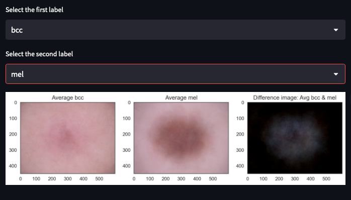

#### Image montage
```
def image_montage(dir_path, label_to_display, nrows, ncols, figsize=(15, 10)):
    """
    if the label exists in the directory
    check if your montage space is greater than the subset size
    create a list of axes indices based on nrows and ncols
    create a Figure and display images
    in this loop, load and plot the given image
    """

    if label_to_display in labels:

        images_list = os.listdir(dir_path + '/' + label_to_display)
        if nrows * ncols < len(images_list):
            img_idx = random.sample(images_list, nrows * ncols)
        else:
            print(
                f"Decrease nrows or ncols to create your montage. \n"
                f"There are {len(images_list)} in your subset. "
                f"You requested a montage with {nrows * ncols} spaces")
            return

        # create a list of axes indices based on nrows and ncols
        list_rows = range(0, nrows)
        list_cols = range(0, ncols)
        plot_idx = list(itertools.product(list_rows, list_cols))

        # create a Figure and display images
        fig, axes = plt.subplots(nrows=nrows, ncols=ncols, figsize=figsize)
        for x in range(0, nrows*ncols):
            img = imread(dir_path + '/' + label_to_display + '/' + img_idx[x])
            img_shape = img.shape
            axes[plot_idx[x][0], plot_idx[x][1]].imshow(img)
            axes[plot_idx[x][0], plot_idx[x][1]].set_title(
                f"Width {img_shape[1]}px x Height {img_shape[0]}px")
            axes[plot_idx[x][0], plot_idx[x][1]].set_xticks([])
            axes[plot_idx[x][0], plot_idx[x][1]].set_yticks([])
        plt.tight_layout()
        plt.show()

    else:
        print("The label you selected doesn't exist.")
        print(f"The existing options are: {labels}")
```
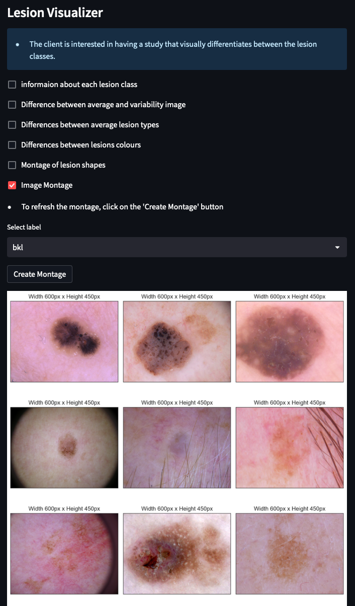

#### Plot number of images in train, validation, and test set.
```
df_freq = pd.DataFrame([])
for folder in ['train', 'validation', 'test']:
    for label in train_labels:
        df_freq = df_freq.append(
            pd.Series(data={'Set': folder,
                            'Label': label,
                            'Frequency': int(len(os.listdir(my_data_dir + '/' + folder + '/' + label)))}
                      ),
            ignore_index=True
        )

        print(
            f"* {folder} - {label}: {len(os.listdir(my_data_dir+'/'+ folder + '/' + label))} images")

print("\n")
sns.set_style("whitegrid")
plt.figure(figsize=(8, 5))
sns.barplot(data=df_freq, x='Set', y='Frequency', hue='Label')
plt.savefig(f'{file_path}/labels_distribution.png',
            bbox_inches='tight', dpi=150)
plt.show()
```

```
* train - akiec: 228 images
* train - df: 80 images
* train - bkl: 769 images
* train - vasc: 99 images
* train - nv: 4693 images
* train - bcc: 359 images
* train - mel: 779 images
* validation - akiec: 32 images
* validation - df: 11 images
* validation - bkl: 109 images
* validation - vasc: 14 images
* validation - nv: 670 images
* validation - bcc: 51 images
* validation - mel: 111 images
* test - akiec: 67 images
* test - df: 24 images
* test - bkl: 221 images
* test - vasc: 29 images
* test - nv: 1342 images
* test - bcc: 104 images
* test - mel: 223 images
```
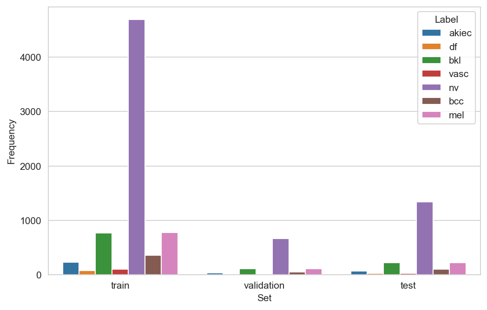

#### Augmenting images and loading from folder to memory

```
train_set = augmented_image_data.flow_from_directory(train_path,
                                                     target_size=image_shape[:2],
                                                     color_mode='rgb',
                                                     batch_size=batch_size,
                                                     class_mode='categorical',
                                                     shuffle=True
                                                     )

print(image_shape[:2])
train_set.class_indices
```

#### SMOTE for imbalance
```
from imblearn.over_sampling import SMOTE

# Create SMOTE instance
oversample = SMOTE()

# Apply SMOTE to the training data (not test data)
Data_train, Label_train = oversample.fit_resample(Data_train, Label_train)

# Reshape the data if needed
Data_train = np.array(Data_train).reshape(image_shape)

# Print the shape of the data
print('Shape of Data:', Data_train.shape)
```

#### Upsampling and downsampling for imbalance
```
def balance_dataset(original_directory, new_directory, target_size=(75, 75), batch_size=32, target_count=800):
    datagen = ImageDataGenerator(
    rescale=1./255,
    rotation_range=10,  # Rotation within a range of +/- 10 degrees
    zoom_range=0.1,  # Zoom in or out by 10%
    horizontal_flip=True,  # Horizontal flip
    vertical_flip=True,   # Vertical flip
    brightness_range=(0.9, 1.1),  # Slightly adjust brightness
    width_shift_range=0.1,  # Horizontal shift within a range of +/- 10% of the width
    height_shift_range=0.1  # Vertical shift within a range of +/- 10% of the height
)
    
    generator = datagen.flow_from_directory(
        directory=original_directory,
        target_size=target_size,
        batch_size=batch_size,
        class_mode="categorical",
        shuffle=False
    )
    
    _, y = next(generator)
    class_counts = np.sum(y, axis=0)
    
    if not os.path.exists(new_directory):
        os.makedirs(new_directory)
    for class_name in generator.class_indices.keys():
        os.makedirs(os.path.join(new_directory, class_name), exist_ok=True)
    
    for i, class_name in enumerate(generator.class_indices.keys()):
        src_class_dir = os.path.join(original_directory, class_name)
        dest_class_dir = os.path.join(new_directory, class_name)
        
        file_names = os.listdir(src_class_dir)
        
        if class_counts[i] > target_count:
            file_names = np.random.choice(file_names, target_count, replace=False)
            for file_name in file_names:
                shutil.copy(os.path.join(src_class_dir, file_name), dest_class_dir)
        elif class_counts[i] < target_count:
            num_to_add = target_count - class_counts[i]
            file_names_to_duplicate = np.random.choice(file_names, int(num_to_add))
            for j, file_name in enumerate(file_names_to_duplicate):
                shutil.copy(os.path.join(src_class_dir, file_name), os.path.join(dest_class_dir, f"copy_{j}_{file_name}"))
        else:
            for file_name in file_names:
                shutil.copy(os.path.join(src_class_dir, file_name), dest_class_dir)
```

#### Defining neural network architecture
```
def create_tf_model(num_classes, input_shape=image_shape):
    # Defining base model using Xception module from Keras
    base_model = Xception(include_top=False, weights='imagenet', input_shape=input_shape)
    for layer in base_model.layers:
        layer.trainable = True
    
    # Initialize the Sequential model
    model = Sequential()
    
    # Adding the base model
    model.add(base_model)

    # Adding Flatten Layer
    model.add(Flatten())

    # Adding Dense Layers
    model.add(Dense(128))
    model.add(Dropout(0.5))
    model.add(BatchNormalization())
    model.add(Activation('relu'))

    # Output Layer
    model.add(Dense(num_classes))

    # Compiling the model
    model.compile(loss=tf.keras.losses.SparseCategoricalCrossentropy(from_logits=True),
                  optimizer='adam',
                  metrics=['accuracy'])

    # Return the compiled model
    return model
```

#### Using techniques to prevent overfitting (such as early stopping and dropout layer)

```
from tensorflow.keras.callbacks import EarlyStopping
early_stop = EarlyStopping(monitor='val_loss', patience=3)
```

#### Fit the model/pipeline
```
model = create_model(num_classes=7)

model.fit(X_train ,
          y_train ,
          epochs=35 ,
          batch_size=128,
          validation_data=(X_test , y_test) ,
          callbacks=[learning_rate_reduction])
```

#### Conducting hyperparameter optimization
```
def train_model_with_hyperparameters(learning_rate, df_train, df_val):
    # Define the model
    model = create_tf_model(num_classes=len(class_names), input_shape=(img_height, img_width, 3))

    # Compile the model with the given learning rate
    model.compile(optimizer=Adam(learning_rate=learning_rate),
                  loss=tf.keras.losses.SparseCategoricalCrossentropy(from_logits=True),
                  metrics=['accuracy'])

    # Define early stopping callback
    early_stopping = EarlyStopping(monitor='val_loss', patience=3)

    # Fit the model using your datasets
    history = model.fit(
        df_train,
        validation_data=df_val,
        epochs=20,
        callbacks=[early_stopping]
    )

    # Get the best validation accuracy for this hyperparameter
    best_val_acc = max(history.history['val_accuracy'])

    return best_val_acc

# Define the hyperparameters you want to tune
learning_rates = [0.001, 0.0001, 0.00001]

# Dictionary to store the best validation accuracy for each set of hyperparameters
best_val_acc_per_hyperparam = {}

# Loop over the hyperparameters
for learning_rate in learning_rates:
    print(f"Training with learning rate: {learning_rate}")
    
    # Train the model with the current set of hyperparameters
    best_val_acc = train_model_with_hyperparameters(learning_rate, df_train, df_val)
    
    # Store the best validation accuracy for this set of hyperparameters
    best_val_acc_per_hyperparam[f'learning_rate_{learning_rate}'] = best_val_acc

# Print the best validation accuracies for each set of hyperparameters
print("\nBest validation accuracies for each set of hyperparameters:")
for hyperparams, val_acc in best_val_acc_per_hyperparam.items():
    print(f"{hyperparams}: {val_acc}")
```

#### Assessing feature importance
With the csv that came with the lesion data. I also looked at some of the patterns in the data to see if it will help with the classification. 

* Feature Importance
```
data = pd.read_csv("inputs/skin_cancer_dataset/HAM10000_metadata.csv")

data = data.drop(columns=["lesion_id", "image_id"], errors="ignore")

data = data.fillna(data.mean())

for column in ["dx_type", "sex", "localization"]:
    le = LabelEncoder()
    data[column] = le.fit_transform(data[column])

X = data.drop('dx', axis=1)
y = data['dx']

# Split the data into training and test sets
X_train, X_test, y_train, y_test = train_test_split(X, y, test_size=0.3, random_state=42)

# Train a Decision Tree classifier
model = DecisionTreeClassifier(max_depth=3)  # limit depth of tree
model.fit(X_train, y_train)

# Make predictions on the test set
y_pred = model.predict(X_test)

# Evaluate the model
print(classification_report(y_test, y_pred))
print(confusion_matrix(y_test, y_pred))

# Print feature importance
print("Feature importances:")
for name, importance in zip(X.columns, model.feature_importances_):
    print(f"{name}: {importance}")
```
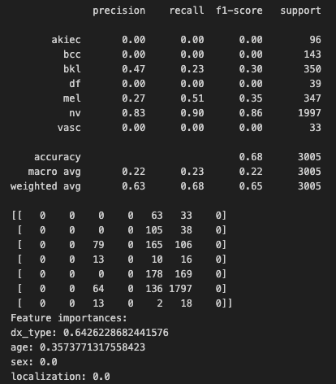

* Age Distribution
```
import seaborn as sns
import matplotlib.pyplot as plt

plt.figure(figsize=(10, 6))
sns.boxplot(x='dx', y='age', data=data)
plt.title('Age distribution by dx (label)')
plt.show()
```
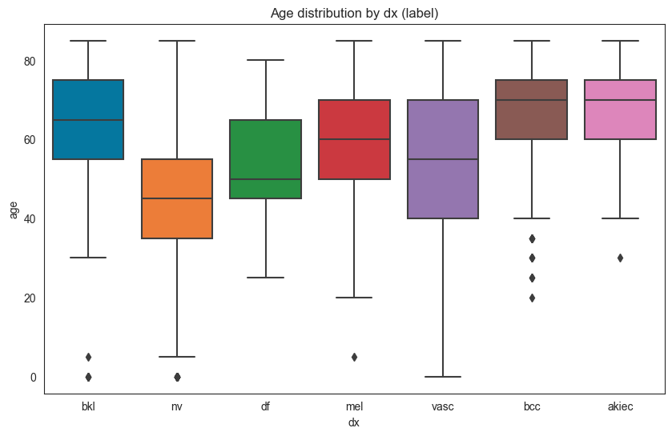

* Cross-tabulation of Lesion Diagnosis (dx) and Diagnosis Method (dx_type)
```
data = pd.read_csv("inputs/skin_cancer_dataset/HAM10000_metadata.csv")

cross_tab = pd.crosstab(data['dx'], data['dx_type'])
print("\nCross-tabulation between dx_type and dx:")
print(cross_tab)

plt.figure(figsize=(10, 7))
sns.heatmap(cross_tab, annot=True, fmt="d", cmap="YlGnBu")
plt.title('Cross-tabulation between dx_type and dx')
plt.show()
```
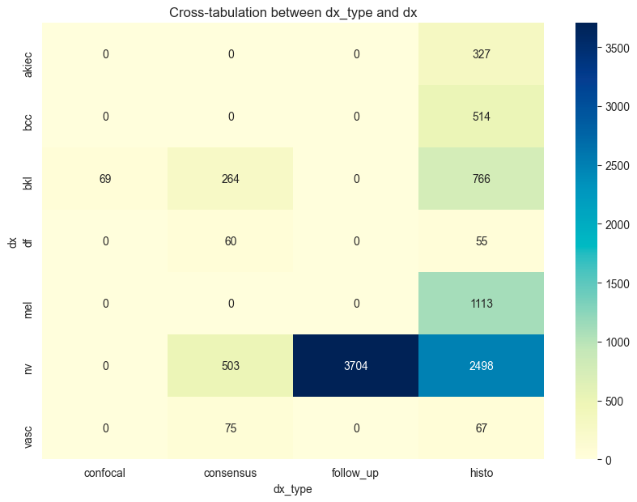

---

## The rationale to map the business requirements to the Data Visualisations and ML tasks

### Business Requirement 1

- **Business Requirement 1**: The client aims to visually differentiate lesions. The model should be capable of reaching an accuracy of at least 70%.

**Rationale**: 
- We will display the "mean" and "standard deviation" images for each lesion type.
- We will display the difference between each classes average image.
- We will display an image montage for each lesion class.

### Business Requirement 2

- **Business Requirement 2**: The model should provide a confidence level for each prediction.

**Rationale**: 
- This requirement links directly to the model's output interpretation. Most classification models can offer a probability or confidence score along with the class prediction. 
- Understanding the distribution of these confidence scores can be achieved via data visualisations like histograms or density plots.

### Business Requirement 3

- **Business Requirement 3**: If a skin lesion is predicted as malignant with high confidence, the system should recommend immediate medical consultation.

**Rationale**: 
- This requirement involves the application of a decision rule on the model's output. It doesn't directly correspond to a specific ML task or data visualisation,
- its effectiveness can be validated through techniques like Precision-Recall, which offer a trade-off visualisation between recall (sensitivity) and precision for different threshold settings.

### Business Requirement 4

- **Business Requirement 4**: The project will deliver a web application where users can upload a skin lesion image, and the system will provide a diagnosis, a confidence level of the prediction.

**Rationale**: 
- While not a direct ML task, this requirement relates to deploying the model within a user-accessible application.
- Displaying the model's results, including the diagnosis, associated confidence level.
- Show the data visualisations in a user-friendly interface.

### Business Requirement 5

- **Business Requirement 5**: The AI model's insights should assist healthcare professionals in making informed decisions about the treatment process.

**Rationale**: 
- This requirement pertains to the application of the ML model's results in a real-world healthcare context. 
- Clear and comprehensible data visualisations are crucial for this requirement.
- Show the confidence levels, for each lesion type that can aid healthcare professionals.

### Business Requirement 6

- **Business Requirement 6**: The model's performance will be evaluated using balanced performance metrics such as F1 Score.

**Rationale**: 
- These performance metrics are integral to assess the model's performance in a balanced manner, especially in the case of imbalanced datasets. 
- Precision-Recall  provide visualisations to comprehend the performance of the model at various threshold settings. 
- The F1 Score is a harmonic mean of precision and recall, providing a singular metric that balances both these important measures.

### Business Requirement 7

- **Business Requirement 7**: The client is interested to have a study to visually differentiate between lesions.

**Rationale**: 
- We will display an image montage for all the types of lesions, 
- We will display the "mean" and "standard deviation" images and display the difference between an average of each lesion type.

---

## ML Business Case

- We want an ML model to predict the lesion class, based on historical image data. It is a supervised model, a 7-class, single-label, classification model.
- Our ideal outcome is to provide the medical team and patients a faster and more reliable diagnostic for lesion detection.
- The model success metrics are
- - Accuracy of 65% or above on the test set.
- The model output is defined as a flag, indicating what type of lesion and the associated probability of being part of that class. The user will take a picture of the lesion and upload the picture to the App. The prediction is made on the fly (not in batches).
- Heuristics: The current diagnostic needs an experienced staff and detailed inspection to distinguish the type of lesion and that has a 70% accuracy. Further inspections and processes are needed to get the exact type of lesion. On top of that, some specific hospital facilities need more trained staff and expertise and are typically understaffed. There is also lokng waits to see a GP for a lesion check.
- The training data to fit the model come from the International Skin Imaging Collaboration (ISIC). This dataset contains about 10+ thousand images. We have extracted the images from Kaggle.
Train data - target: type class; features: all images

- What is the business objective requiring a ML solution?

The business objective is to develop an AI-powered application that assists in the early identification of skin cancer. The AI model will differentiate between different typesof lesions based on images, thereby providing a rapid diagnosis and recommending further medical consultation when necessary.

- Can traditional data analysis be used?

Traditional data analysis can be used to some extent, such as finding correlations or identifying patterns. However, given the complexity of image analysis and the need for predictive capabilities, machine learning, specifically deep learning methods, would likely be more efficient and effective.

- Does the customer need a dashboard or an API endpoint?

The customer needs a web application where users can upload an image of a skin lesion and receive an immediate prediction. This would likely be implemented through a combination of a user-friendly dashboard that interact with the underlying machine learning model.

- What does success look like?

Success would be a functional application that can accurately differentiate between benign and malignant skin lesions, provide confidence levels for its predictions, and suggest further medical consultation when necessary. The solution should be reliable enough to assist healthcare professionals in their decision-making process, leading to earlier and more effective treatment of skin cancer.

- Can you break down the project into epics and user stories?

Yes epics and user stories for this project are shown above.

- Ethical or privacy concerns?

Yes, this project does have ethical and privacy concerns. It's crucial to ensure that all skin lesion images are anonymised and that user data is securely stored and handled. Consent should be obtained before using any personal data, and the app should comply with relevant data protection regulations. Also, the solution should not replace professional medical advice; it's meant to assist in the initial screening process.

- What level of prediction performance is needed?

Given the serious implications of false negatives (missing a malignant lesion) and false positives (misidentifying a benign lesion as malignant), a high level of prediction performance is needed. The model should strive for high sensitivity (minimising false negatives) at ideally over 70% and specificity (minimising false positives) above 70%.

- What are the project input and intended outputs?

The input for the project will be images of skin lesions. The intended output will be a diagnosis (benign or malignant), a confidence level associated with the prediction, and in the case of a high-confidence malignant prediction, a recommendation for immediate medical consultation.

- Does the data suggest a particular model?

Given the nature of the data (images) and the task (classification), a Convolutional Neural Network (CNN) is a suitable model as it has proven to be effective for image classification tasks. Depending on the results of initial experiments, more advanced models or ensemble methods might be considered.

- How will the customer benefit?

The customer will benefit from a faster and more efficient initial screening process for skin cancer. The application can provide immediate feedback, allowing for potential early detection and treatment. It should also reduce the workload for healthcare professionals by serving as a first step in the diagnosis process.

### Possible Heuristics

Image Preprocessing: Images may need to be resized or normalised to ensure consistency across the dataset. This can involve scaling the images to have the same width and height and normalising the pixel values.

Class Imbalance: If the dataset has many more examples of one class (e.g., benign) than another (e.g., malignant), it may be necessary to balance the classes using techniques like oversampling the minority class, undersampling the majority class, or using a combination of both (SMOTE).

Splitting the Data: A standard heuristic in machine learning is to split the available data into training, validation, and test sets. A common split is 70% for training, 10% for validation, and 10% for testing.

Model Selection: Start with simpler models and progress to more complex ones if necessary. This heuristic helps to prevent overfitting and reduces computational resources.

Confidence Thresholds: Establish a threshold for determining when the model's prediction confidence is high enough to recommend immediate medical consultation. This can be determined by assessing the model's performance at various threshold levels on a validation set.

Error Analysis: If the model's performance is not satisfactory, perform error analysis to understand the types of mistakes the model is making. This can often provide insights into what can be improved.

Model Interpretability: Even though more complex models like deep learning might provide better performance, simpler models, or the use of interpretability techniques might be preferred in this case, given the importance of the healthcare professionals being able to understand and trust the model's predictions.

Data Privacy: Given the sensitive nature of medical images, ensure all data is handled in compliance with relevant privacy laws and regulations. Images should be anonymised, and any personally identifiable information should be removed.

---

## Dashboard Design

### Pages

**Project Summary** - This page provides an overall summary of the project. Showing the outline of the system, information about the data set, the business requirments and a link to this read me. This answers Business Requirement 4.

- Project Description: Brief text block summarizing the project, the goals, and the proposed AI solution.
- Warning: Explaining he importance of seeing a medical profession for a check up. 
- System Outline:The overall system architecture.
- Data Set Information: Summary statistics, metadata, and other relevant details about the data set being used.
- Business Requirements: A concise list of the business requirements guiding the project.
- Read Me Link: A clickable button or hyperlink leading to a more detailed project documentation.
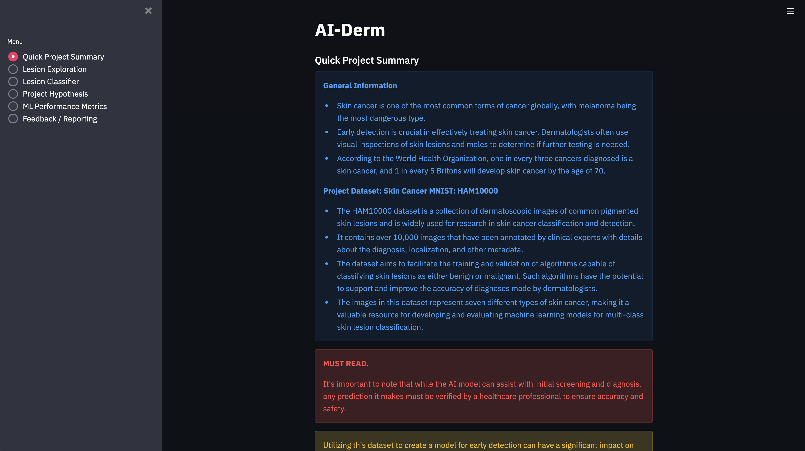

**Lesion Exploration** - This page provides a overview of the lesions so you can see the differances. This answers Business Requirement 1, 4, 5, 7.

- Lesion Visualizer: A section that provides an overview of the lesion exploration functionality.
- Information about Each Lesion Class: A checkbox option to display information about each lesion class, including descriptions and characteristics of different types of skin lesions.
- Difference between Average and Variability Images: A checkbox option to visualize the differences between average and variability images for different lesion classes.
- Differences between Average Lesion Types: A checkbox option to compare the average images of two selected lesion types and visualize the differences.
- Differences between Lesion Colors: A checkbox option to compare the color distributions of two selected lesion types and visualize any differences.
- Montage of Lesion Shapes: A checkbox option to display a montage of lesion shapes, showcasing the distinct shapes associated with different lesion types.
- Image Montage: A checkbox option to create and display an image montage of a selected lesion type from the dataset.
- Create Montage Button: A button that generates a new image montage based on the selected lesion type.
- Image Montage Display: The generated image montage displayed on the page.

Note: Each checkbox option can be independently selected or deselected to control the visibility of the corresponding visualization on the page.
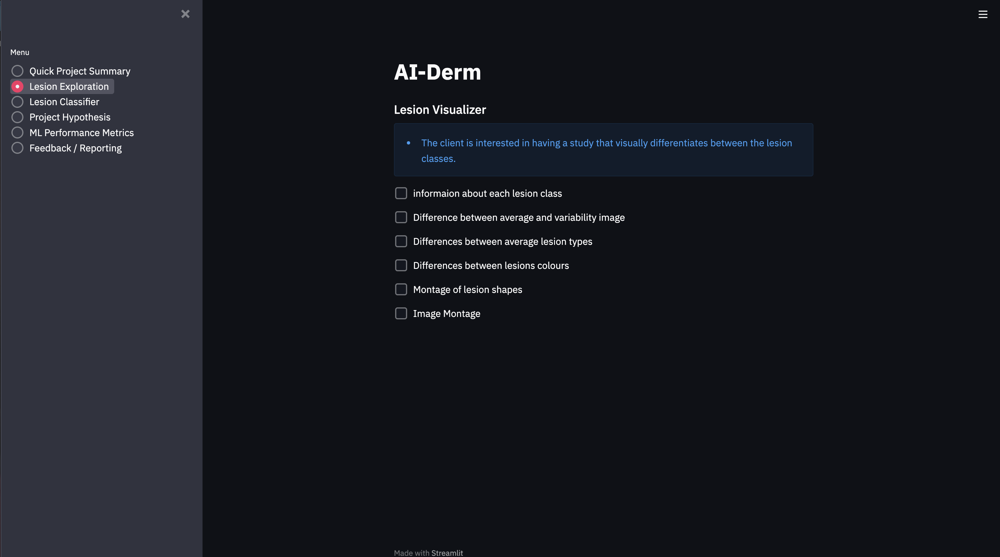

**Upload page and Results** - This page allows users (either individuals or healthcare professionals) to upload a skin lesion image for diagnosis. After the image is processed, the diagnosis and confidence level. This answers Business Requirement 1, 2, 3, 4 and 5.

- Image Upload Interface: A form or button allowing users to upload skin lesion images for analysis.
- Diagnosis Display: A text block or similar element showing the diagnosis once the image has been processed.
- Confidence Level Display: A bar chart, gauge, or similar visualization showing the confidence level associated with the diagnosis.
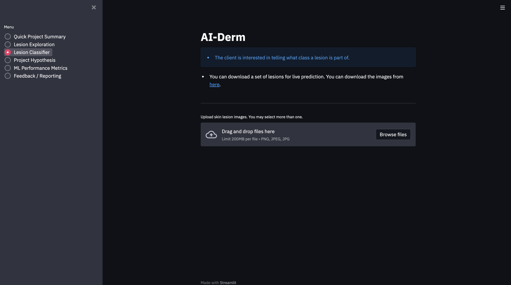

**Project Hypothesis and Validation** - This page contains information related to the initial assumptions or hypotheses made about the project, and how those hypotheses are being validated or have been validated.

- Hypotheses List: A bulleted or numbered list of the initial project hypotheses.
- Validation Approach: A text block explaining how each hypothesis is or will be validated.
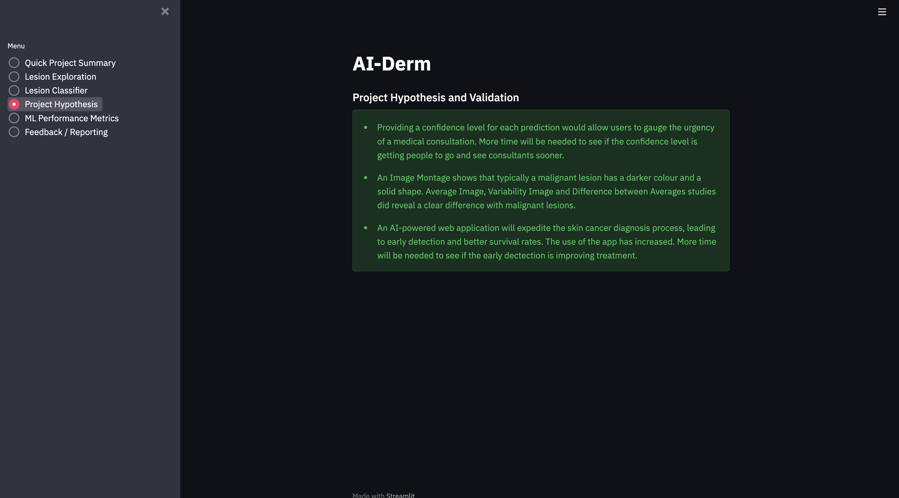

**ML Performance Page** - This page presents detailed metrics on the performance of the AI model. It might include confusion matrix, ROC curve, precision-recall curve, F1 score, AUC-ROC value, etc. It can also include a comparison of performance metrics over different versions of the model. This answers Business Requirement 6 and 7.

- Model Metrics: Various visualizations (like confusion matrix, ROC curve, precision-recall curve) showing detailed performance metrics for the AI model.
- Model Comparison: A table or graph comparing the performance of different model versions or configurations.
- Model Interpretation: A text block explaining what these metrics mean in terms of model performance and quality.
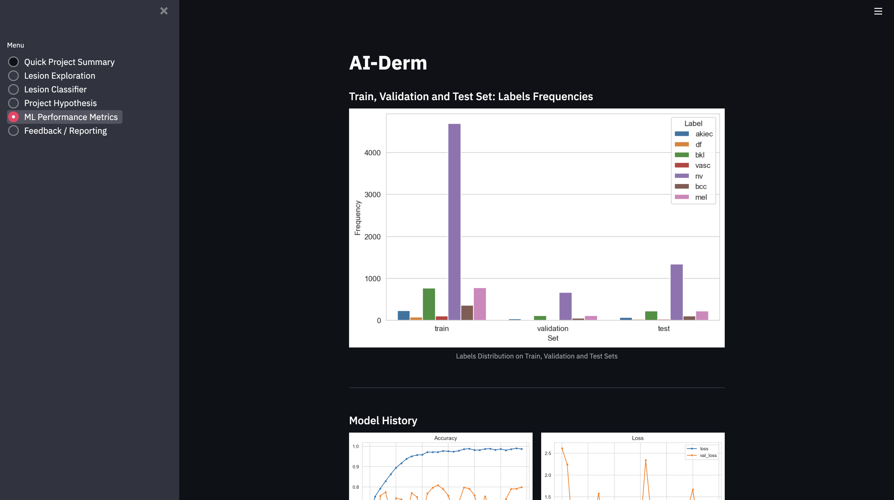

The information on the ML Performance Page are:
1. Distribution - 
  - This image the dataset size and label frequencies and displays the target inequality. Using augmentaion has to be careful because the image could get warp so that it doesnt look like a lesion.
2. Model training acc - 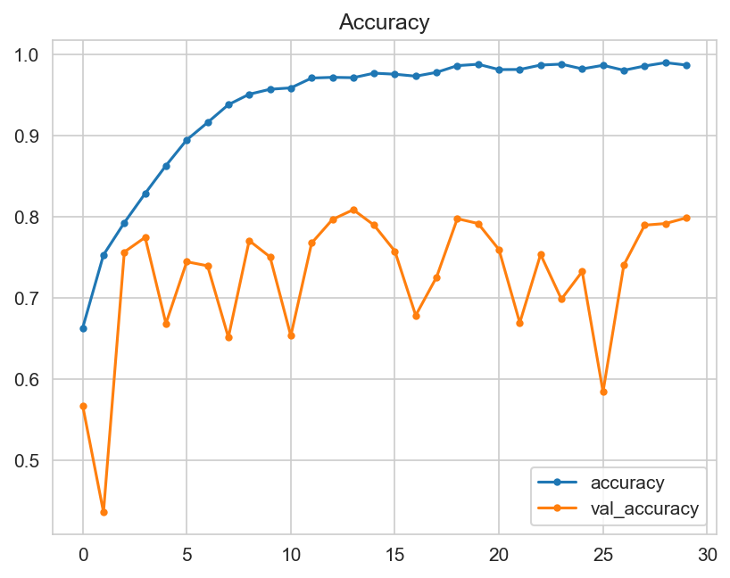
   - This shows the model by epoch, specifically the accuracy per epoch, is displayed. 
3. Model training losses - 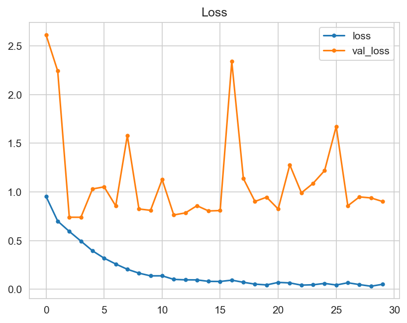
  - This shows the model by epoch, specifically the loss per epoch, is displayed. 
4. Generalised Performance on Test Set - 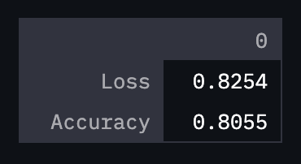
  - This shows the loss and accuracy for the model.
5. Confusion matrix - 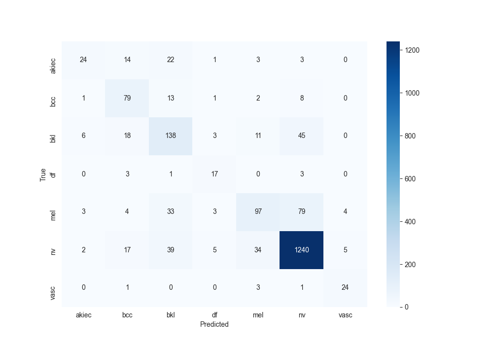
  - A confusion matrix for predicted and actual outcomes for the test set is shown here. 
6. Classification report - 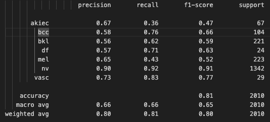
  - This classification report provides various metrics to evaluate the performance of a classification model.
7. Roc curves - 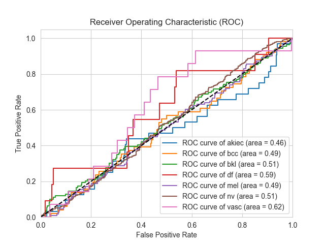
  - ROC curves are graphical representations is used to evaluate the performance of binary classification models
8. Precision recall curves - 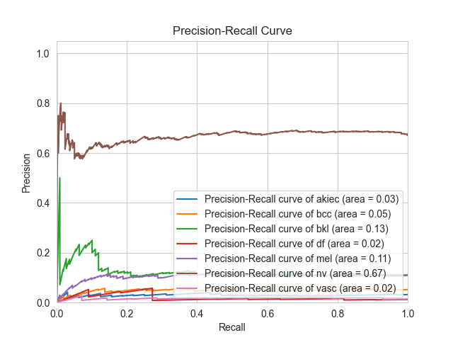
  - Precision-Recall curves is used to evaluate the performance of a binary classification model, particularly in this case where there is class imbalance.

**Feedback / Reporting Page** - This page allows users to provide feedback on the system's performance and report any issues. It could be a form where users can rate the system, leave comments, or report false positives/negatives. It will also show future features for the system.

- User Feedback Form: A form where users can rate their experience with the system, leave comments, or report false positives or negatives.
- Reporting Mechanism: A separate form or section where users can report technical issues or other problems with the system.
- Future Features: A text block outlining upcoming features or improvements planned for the system.
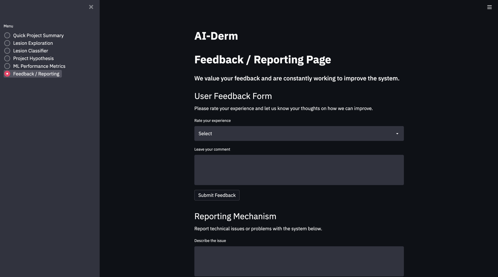

---

## Requirements Evaluation

**Business Requirement 1**: The client aims to visually differentiate lesions. The model should be capable of reaching an accuracy of at least 70%.
- Solution: The model has an accuracy of 80%. shown below.
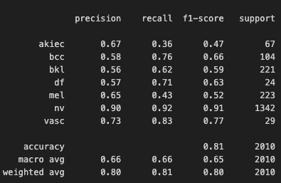

**Business Requirement 2**: The model should provide a confidence level for each prediction.
- Solution: When you upload an image a confidence level is given to the user. Shown below.
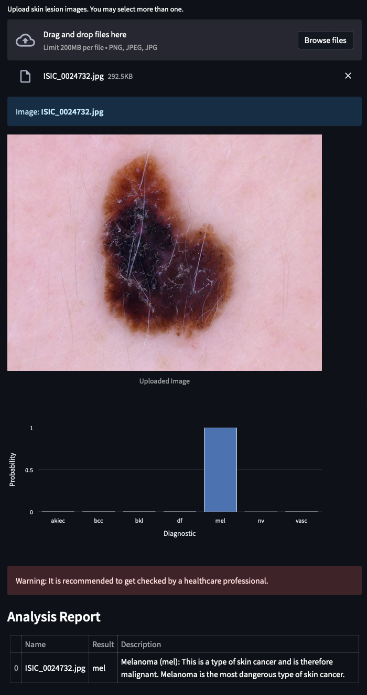

**Business Requirement 3**: If a skin lesion is predicted as malignant with high confidence, the system should recommend immediate medical consultation.
- Solution: If the model predicts a dangerous lesion it will give a message and it will still advise a check up and verification if it is another kind of lesion. Examples are shown below.
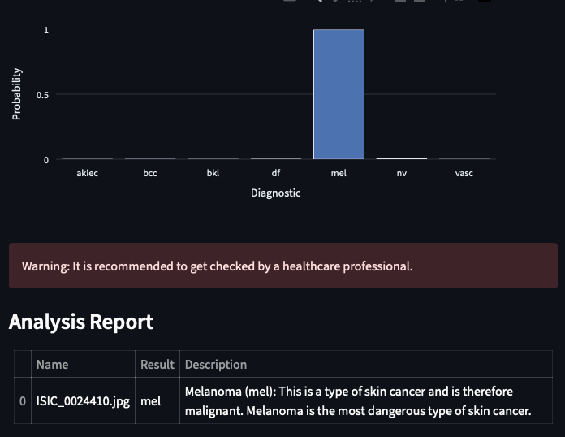
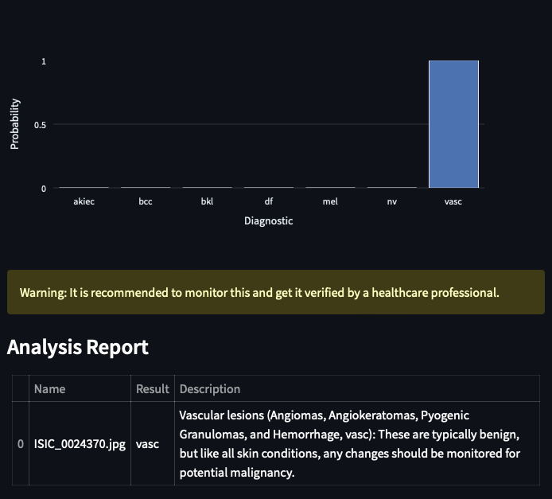

**Business Requirement 4**: The project will deliver a web application where users can upload a skin lesion image, and the system will provide a diagnosis, a confidence level of the prediction.
- Solution: The application can be found here.
Deployed version at [AI-DermDiagnosis](https://ai-dermdiagnosis-75d8dba881ea.herokuapp.com/)

**Business Requirement 5**: The AI model's insights should assist healthcare professionals in making informed decisions about the treatment process.
- Solution: The application has the classifier to help pedict and also has images to see visual differences. 


**Business Requirement 6**: The model's performance will be evaluated using balanced performance metrics such as F1 Score.
- Solution: The application has the scores for the model below.
 

**Business Requirement 7**: The client is interested to have a study to visually differentiate between lesions.
- Solution: The application has images to see visual differences. Example is shown below.


---

## CRISP DM Process

CRISP-DM, which stands for Cross-Industry Standard Process for Data Mining, is an industry-proven way to guide your data mining efforts.

As a methodology, it includes descriptions of the typical phases of a project, the tasks involved with each phase, and an explanation of the relationships between these tasks.
As a process model, CRISP-DM provides an overview of the data mining life cycle. Below are the steps that I took this project

**1. Business Understanding**
- Identify the business objectives: Develop a system for skin lesion classification and visualization to assist in early detection of skin cancer.
- Define the project requirements: Build a machine learning model to classify different types of skin lesions and provide visual exploration capabilities.

**2. Data Understanding**
- Explore the available dataset: Analyze the Skin Cancer MNIST dataset, which contains dermatoscopic images of skin lesions annotated with diagnosis and metadata.
- Assess data quality and completeness: Check for missing values, data imbalance, and evaluate the relevance of the dataset for achieving project goals.

**3. Data Preparation**
- Perform data preprocessing: Clean the dataset, handle missing values, and address any data quality issues.
- Prepare the data for modeling: Split the dataset into training and validation sets, apply appropriate feature engineering techniques, and address class imbalance if necessary.

**4. Modeling**
- Design the machine learning model: Define the architecture and hyperparameters of the model, considering factors such as the number of layers, activation functions, and optimization algorithms.
- Train the model: Fit the model to the training data and tune the hyperparameters to optimize performance.
- Evaluate model performance: Measure the accuracy, precision, recall, and other relevant metrics to assess the model's performance on the validation set.

**5. Evaluation**
- Assess model effectiveness: Evaluate the model's ability to classify skin lesions accurately and visualize different lesion classes effectively.
- Validate against business requirements: Compare the model's performance with the predefined business requirements, such as accuracy thresholds and visualization goals.

**6. Deployment**
- Implement the model in a web application: Create a user-friendly interface where users can upload skin lesion images and receive predictions and visualizations.
- Deploy the application: Make the application accessible online, ensuring scalability, security, and robustness.

**7. Monitoring and Maintenance**
- Continuously monitor model performance: Track key metrics and evaluate the model's accuracy and visual exploration capabilities over time.
- Collect user feedback: Gather user feedback and incorporate improvements based on user experiences and requirements.
- Maintain and update the system: Regularly update the model, address software bugs, and incorporate new features or data sources as needed.

By following the CRISP-DM methodology, and using the tools on GitHub can achieve a systematic and structured approach to developing a skin lesion classification and visualization system, ensuring alignment with business objectives and delivering a robust and effective solution.

---

## Improvements and Future Plans

### Feedback page Forms.
Currently, the feedback and bug reporting feature within the app is not functional as it does not send messages. This is because the client has yet to provide the email address to which these comments and messages should be directed. Once I have received this information, I will promptly configure the email functionality, ensuring the seamless transmission of feedback and bug reports.

### Improved accuracy in predictions.
At present, the model boasts an accuracy of 80%, which, although impressive, leaves room for enhancement. It would be exceptional if the model's performance could be elevated to achieve even higher accuracy. Additionally, improving the F1 score is crucial, as this would indicate a more balanced ratio between precision and recall, thereby making the model more reliable. This enhancement can be accomplished through various means, such as class balancing, data augmentation, hyperparameter tuning, employing a more complex architecture, or incorporating ensemble methods. A significant boost in accuracy could position the application as a primary tool for individuals in classifying their lesions, rather than merely serving as an auxiliary resource.

### Support for additional skin types and conditions.
While the HAM10000 dataset provides a solid foundation for skin cancer detection models, it is imperative to recognize the need for inclusivity and diversity in medical datasets. Skin cancer can manifest differently on black skin compared to white skin, and historically, medical datasets have not been representative of the diversity in skin types. As part of responsible AI development, it is essential to ensure that models are trained on data that represents all skin tones. This will enable the development of robust and unbiased models that can effectively serve diverse populations. Researchers and developers should consider augmenting datasets like HAM10000 with additional images representing black and brown skin tones. This is a critical step in developing models that are equally effective in detecting skin cancer among individuals with darker skin and addressing health disparities.

### Enhanced user interface for easier navigation.
The application could be meticulously designed to ensure cross-platform compatibility, making it accessible on various devices. Furthermore, by integrating it into an all-encompassing healthcare application, the user experience can be significantly enriched. The interface could be intuitively designed with streamlined navigation to facilitate user engagement and provide them with critical health insights at their fingertips.

### Option to consult a dermatologist through the platform.
Incorporating an option that allows users to schedule consultations with dermatologists directly through the application could be invaluable. By doing so, users can effortlessly transition from receiving an initial classification result to discussing it with a medical expert. This feature could also include a provision for virtual consultations, ensuring that specialist advice is just a few clicks away, irrespective of the user’s location.

### Integration with health applications to track skin health over time.
The app could be equipped with a comprehensive tracking system that enables users to monitor the evolution of their skin lesions over time. By allowing users to log and compare images, the application could provide crucial data on changes in shape, size, and other attributes of the lesions. This feature could be enhanced with machine learning algorithms to predict trends and alert the user to any concerning developments. Moreover, integrating this with other health applications could enable holistic health monitoring, empowering users to take proactive measures in managing their skin health.

---

## Bugs

### Fixed Bug: Blue-Tinted Images

#### Issue:
The images displayed appeared with a blue tint. This was due to a discrepancy in color channel ordering, as OpenCV reads images in BGR (Blue-Green-Red) format while matplotlib’s imshow expects them in RGB (Red-Green-Blue) format.

#### Resolution:
Converted the color channels from BGR to RGB after reading the image with OpenCV, before displaying it with matplotlib. The conversion can be achieved using cv2.cvtColor() function.

```
import cv2
image = cv2.imread('path_to_image')
image = cv2.cvtColor(image, cv2.COLOR_BGR2RGB)
```

### Bug: Heroku Slug Size

#### Issue:
When deploying the Skin Lesion Classifier app on Heroku, an issue arose due to the size of the model v5 used in the application. The model v5, which offered higher accuracy, exceeded the Heroku slug size limit. This prevented successful deployment of the app on Heroku.

#### Resolution:
As a practical solution, a smaller model variant, model v5 small, which employed MobileNetV2, was chosen. This smaller model utilized less memory space while still providing acceptable accuracy for the skin lesion classification task.

#### Potential Future Solution:
Model Compression: Techniques such as quantization, pruning, or knowledge distillation were explored to reduce the size of the model without sacrificing its performance significantly.

Model Optimization: The model architecture was optimized by reducing the number of parameters, simplifying operations, or utilizing more efficient model architectures. This aimed to decrease the model's memory footprint while maintaining a reasonable level of accuracy.

Alternative Deployment Platform: Considering the limitations imposed by Heroku's slug size restrictions, alternative deployment platforms can be explored that will provide more generous memory limits or more flexible deployment options.

### Bug: Imbalanced Dataset

#### Issue:
The dataset used for training the model is imbalanced, with the 'nv' class having significantly more samples than the other classes. This can affect the model's performance by making it biased towards the majority class.

#### Potential Solution:
Balance the dataset either by oversampling the minority classes, undersampling the majority class, or generating synthetic samples (data augmentation). This can be achieved using techniques such as SMOTE or by using image data generators.

### Fixed Bug: Heroku Deployment Issue due to Large Size

#### Issue:
While deploying the application to Heroku, the size of the TensorFlow library and other components were too large for the allowed storage limit on Heroku.

#### Resolution:
Added non-essential files and directories to the .slugignore file to reduce the slug size. Additionally, considered using smaller, more efficient libraries or optimizing the existing ones.

### Fixed Bug: GitHub File Size Limitation

#### Issue:
Some output files and the first version of the model were too large to be pushed to GitHub due to its file size limitations.

#### Resolution:
Compressed or optimized the large files to reduce their size. Alternatively, used Git LFS (Large File Storage) to store the large files. Additionally, in the case of models, considered saving only the model weights instead of the entire model structure and data.

---

## Deployment

### Cloning & Forking
#### Fork
1. On GitHub.com, navigate to the [dlhamilton/AI-DermDiagnosis](https://github.com/dlhamilton/AI-DermDiagnosis) repository.
2. In the top-right corner of the page, click Fork.
3. By default, forks are named the same as their parent repositories. You can change the name of the fork to distinguish it further.
4. Add a description to your fork.
5. Click Create fork.

#### Clone
1. Above the list of files click the button that says 'Code'.
2. Copy the URL for the repository.
3. Open Terminal. Change the directory to the location where you want the cloned directory.
4. Type git clone, and then paste the URL example ``` git clone https://github.com/dlhamilton/AI-DermDiagnosis.git ```
5. Press Enter.

### Local Deployment
1. Sign up to [Gitpod](https://gitpod.io/)
2. Download the Gitpod browser extension.
3. On GitHub.com, navigate to the [dlhamilton/AI-DermDiagnosis](https://github.com/dlhamilton/AI-DermDiagnosis) repository.
4. Above the list of files click the button that says 'Gitpod'.
5. Once open you will need to install the libraries, you can do this by typing ``` pip3 install -r requirements.txt ``` into the terminal
6. In the terminal type ``` pip3 install jupyter ```
7. In the terminal type ``` jupyter notebook --NotebookApp.token='' --NotebookApp.password='' ``` to start the jupyter server.
8. Open port 8888 preview or browser
9. Open the jupyter_notebooks directory in the jupyter webpage that has opened and click on the notebook you want to open.
10. Click the button Not Trusted and choose Trust. ( Note that the kernel says Python 3. It inherits from the workspace so it will be Python-3.8.12 as installed by our template. To confirm this you can use ! python --version in a notebook code cell.)
12. To start the streamlit app type ``` streamlit run app.py ``` into the terminal. 

### Remote Deployment on Heroku

- The App live link is: <https://ai-dermdiagnosis-75d8dba881ea.herokuapp.com/>
- Set the runtime.txt Python version to a [Heroku-20](https://devcenter.heroku.com/articles/python-support#supported-runtimes) stack currently supported version. The project is currently 3.8.16
- The project was deployed to Heroku using the following steps. These are the steps you can take to deploy the project yourself. 

1. Create a requirements.txt file in your project directory:
  - This file should list all the dependencies that your program needs in order to run. This can be found in the "Data Analysis and Machine Learning Libraries" section.

2. Set the Python version in runtime.txt:
  - Create a file named runtime.txt in your project directory and set the Python version to a Heroku-20 stack currently supported version (e.g., python-3.8.16).

3. Push the recent changes to GitHub:
  - Before you deploy, make sure that you have pushed the recent changes, including the requirements.txt and runtime.txt files, to your GitHub repository.

4. Log in to your Heroku account and create a new app:
  - Go to your Heroku account page and choose "CREATE NEW APP", give it a unique name, and select a geographical region.

5. Add the Heroku Python buildpack:
  - Go to the Settings tab of your Heroku app and under the Buildpacks section, click on "Add buildpack" and select heroku/python.

6. Connect your Heroku app to your GitHub repository:
  - Go to the Deploy tab of your Heroku app, choose GitHub as the deployment method, and click on the "Connect to GitHub" button.
  - A new section will appear where you can search for your GitHub repository. Select your repository name and click "Search". Once it is found, click "Connect".

7. Configure automatic deploys (optional):
  - If you want Heroku to automatically deploy your app whenever you push to the selected branch, click the "Enable Automatic Deploys" button.

8. Deploy your app:
  - Select the branch you want to deploy, then click the "Deploy Branch" button under the Manual Deploy section.

9. Monitor the build process:
  - Wait for the logs to run while the dependencies are installed and the app is being built.

10. Check that Heroku stack is version 20 (if applicable):
  - if the heroku app has the wrong stack then you will need to change it
  1. In Heroku click "account settings" unders the avatar menu on the heroku dashboard.
  2. Scroll down to API Key section and click reveal. Copy the key.
  3. Back in your terminal enter the command ``` heroku login -i```
  4. Enter your email address when prompted.
  5. paste in your API Key for the password. 
  6. Then use the command ``` heroku stack:set heroku-20 -a YOUR_APP_NAME ``` (replace YOUR_APP_NAME with the name of your app).

11. Check if the slug size is too large (if applicable):
  - If the slug size is too large, add large files that are not required for the app to run to the .slugignore file, and then redeploy.

12. Access your deployed app:
  - Once the build process is complete, you can access your app through a link similar to https://your-app-name.herokuapp.com/. There will also be an "Open App" button at the top of the Heroku dashboard.

13. Note your app's live link:
  - Your app is now live at: https://YOUR_APP_NAME.herokuapp.com/

---

## Data Analysis and Machine Learning Libraries

- tensorflow-cpu 2.12.0
  - Used for creating and training deep learning models.
- numpy 1.23.5
  - A fundamental package for array computing. It is used for numerical operations and is the backbone of other libraries like pandas and scikit-learn.
- scikit-learn 0.24.2
  - Used for data preprocessing, various machine learning algorithms, and model evaluation.
- streamlit 1.22.0
  - A library to create custom web apps for machine learning and data science projects with ease. Used for building an interactive dashboard for the project.
- pandas 1.4.0
  - Used for creating and saving data in dataframes, data manipulation, and analysis.
- matplotlib 3.3.1
  - A plotting library for the Python programming language. Used for creating static, interactive, and animated visualizations in Python.
- keras 2.6.0
  - A high-level neural networks API, written in Python. It is used to define and train neural network models with ease, and is often used in conjunction with TensorFlow.
- plotly 5.14.1
  - A graphing library for making interactive, publication-quality graphs. Used for plotting the model's learning curves and other interactive plots.
- seaborn 0.11.0
  - A Python data visualization library based on matplotlib. It provides a high-level interface for drawing attractive and informative statistical graphics, such as the confusion matrix for the model.
- protobuf 3.20.3
  - Used internally by TensorFlow for serializing the model structure and weights.
- Jinja2 3.1.2
  - Used for rendering data in web apps, including those created with Streamlit.
- joblib 1.2.0
  - A set of tools for lightweight pipelining in Python. Used for saving scikit-learn models and loading them.
- Keras-Preprocessing 1.1.2
  - A utility library that provides essential functions for preprocessing the data before feeding it into a neural network. It includes functions for encoding labels, normalizing images, and augmenting data.

---

## Technologies used

- Jupiter Notebook
- Kaggle
- GitHub
- Gitpod
- VS Code 
- Heroku
- Python

---

## Credits

### Content

- The lesion dataset was linked from Kaggle and created by Tschandl, P., Rosendahl, C. & Kittler, H.nstitute. https://www.kaggle.com/datasets/kmader/skin-cancer-mnist-ham10000

- There has been useful guidance from various articles from Stack Overflow - https://stackoverflow.com/

- Details about lesions and stats on imaging classification - https://www.ncbi.nlm.nih.gov/pmc/articles/PMC7573031/#:~:text=They%20classify%20three%20different%20classes,keratosis%2C%20and%20benign%20or%20nevus.

- Ideas on how to improve the model for the lesion classification - https://www.nature.com/articles/s41598-022-22644-9

- What to look for in shape and size of lesions - https://patient.info/doctor/black-and-brown-skin-lesions#:~:text=Black%20and%20brown%20skin%20lesions%20can%20be%20considered%20as%20melanocytic,is%20to%20exclude%20malignant%20melanoma.

- lesions on dark skin - https://patient.info/doctor/black-and-brown-skin-lesions

### Media

- The banner for the project was made using https://logo-maker.freelogodesign.org/

---

## Acknowledgements

- A huge thank you to my mentors Chris Quinn, Mo Shami and the Code Institute for their advice and support during the development of this project.

---

### Deployed version at [AI-DermDiagnosis](https://ai-dermdiagnosis-75d8dba881ea.herokuapp.com/)

---